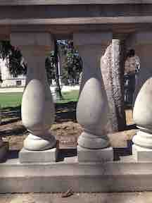
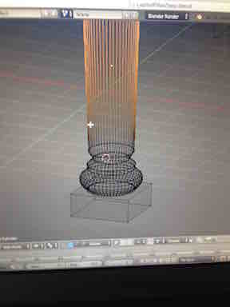
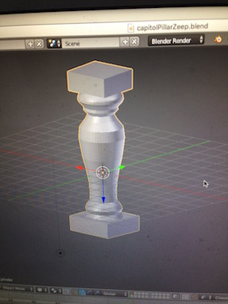
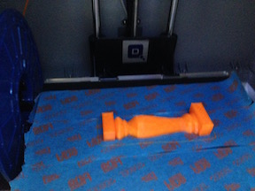
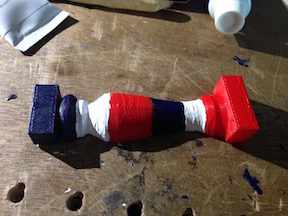
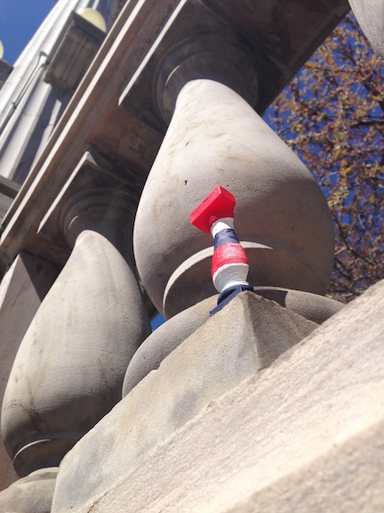
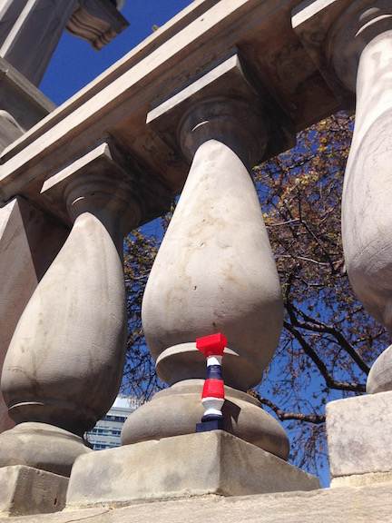
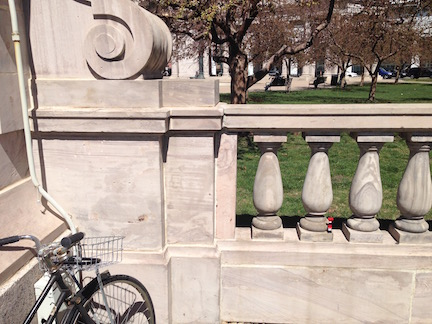
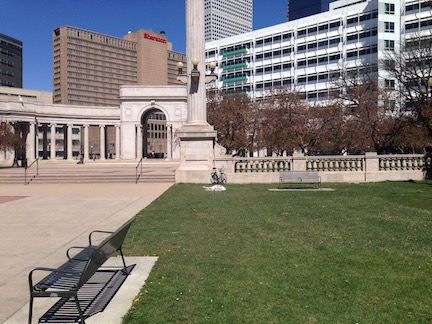
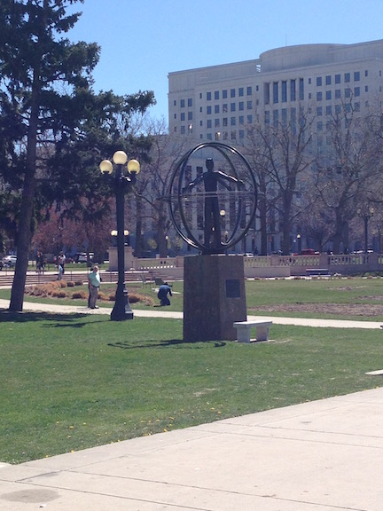

### Origin 

##### April 2, 2016

I was out biking around in the relatively decently warm March sun of Denver in the main park by the Capitol, and decided to photograph this pillar with a old iPhone I use just for photos, and save it and 3d model it.  

And so it begins. My name is Capitol Pillar Zeep.  I am this thing.

### On The couch

I'm chilling on the couch now with my shoes off while listening to Nightwish and the terrible noises the dog is making for some reason probably due to him eating cat litter which he should not have done.  Sky visible out the window from couch is so blue!  

And now the dog has come to see me!  good dog!

### Tracing the photos

Here is a photo:

I've been hanging out now talking about post capitalist industry with a friend who is writing some kind of paper, am back on the couch, back into the Nightwish, working on the pillar, and now it's looking close enough to 3d print.

Finished up a design, got it ready to print, waiting for another Alien Eyeball to finish printing in the Dremel before I load this, time to go wander around in the park and get some sun and also find coffee and also probably a pastry.  

###### April 3, 2016

another beautiful day! with the painting done last night, and to be documented today, I went out and located the artifact in it's location and photographed that, which will get documented here now as well to continue the data loop of this thing.  

now I'm documenting stuff at the coffee shop on my laptop.  I figured out how to re size images finally so that I can have them be a decent size in markdown for github.  

Here is a shot of the screen while I was starting the pillar model on Blender last night:

Getting closer here:

Ok, finished it and sent to the 3d printer, a Dremel:

And then I painted some red white and blue stripes using my acrylic paint set:

That's all I did last night, then today I went back to the original pillar and took some pictures:

I, Pillar Zeep, represent the cartoonish glory of American Empire.

I sit in a symbol of it, this row of stone pillars in front of the seat of power in Colorado.  

This pillar is two in from the end, on the right side when facing downtown from near the Columbus sculpture. 

Walking back from that to get a better view of where this is:

Notice the location of the same bicycle relative to the big fountain on the side of Civic Center Park facing downtown.  

[wikipedia entry on civic center park, showing location](https://en.wikipedia.org/wiki/Civic_Center,_Denver)

Here is the Columbus sculpture that the other photos were taking in front of, facing away from it:

So that's the first part of the tale, the thing got designed, 3d printed, painted, placed, and documented.  What now? Distribute it.  

to do that I need a random price, which I will generate using an i python notebook.  
